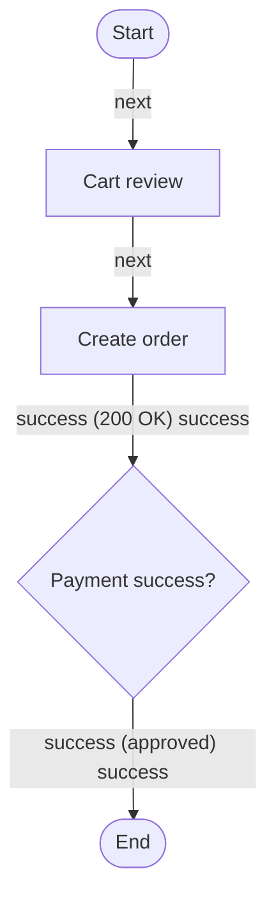

# Building an E-Commerce Platform — Step-by-Step Guide with Example

This tutorial walks you through creating a complete **e-commerce platform**
with SpecForge Studio, step by step. The running example is **Acme Commerce
Platform** — the same example this repository ships as a committed,
regenerable workspace at `docs/workspace/generated-example/` (project
`PRJ-0001`), so every output shown here is real generated output, not
placeholder prose.

Each step maps to one phase of the execution sequence (`prompts/00–13`) and
tells you **what to do**, **what you get**, and **where it lives**.

---

## Step 0 — Set up the workspace

```bash
bun install          # install backend + frontend (Bun workspace)
bun run dev          # API on :3000, web on :5173 (Vite proxies /api)
bun tsc -b --noEmit  # typecheck everything (tests included)
```

In the Freebuff preview: `freebuff-preview start` (ready at the given URL,
verified end-to-end). You get:

- A **memory-driven execution system** (`AGENTS.md`, `memory/`, `prompts/`)
  that carries state across sessions — say `status` anytime, `continue` to
  resume, `approve` to accept a pending decision.
- A project guide at `docs/guide.md` (GUIDE-001) if you need the full manual.

---

## Step 1 — Define the product (Prompt 01)

**What to do:** answer the product questions — who uses it, what it must do,
what is explicitly out of scope — and record them under `docs/product/`.

**E-commerce example (Acme Commerce Platform):**

- **Vision:** a modern e-commerce platform: catalog browsing, shopping cart,
  checkout, order management, and admin analytics.
- **Modules:** `MOD-0001 Catalog`, `MOD-0002 Checkout`.
- **Must-have requirements:**

| ID | Requirement | Type | Priority | Criticality |
|----|-------------|------|----------|-------------|
| REQ-0001 | Customers can browse the product catalog | functional | must | critical |
| REQ-0002 | Customers can complete checkout | functional | must | critical |
| REQ-0003 | Order totals are calculated server-side | constraint | must | critical |

**You get:** an approved product definition (recorded as an approval `APR` in
the governance model) that every later phase traces back to.

---

## Step 2 — Model the domain: entities + IDs (Prompt 02)

**What to do:** define the ontology — entity catalog, ID conventions, and
traceability rules (`docs/ontology/`).

**E-commerce example:** stable, globally unique IDs for every artifact:

| Prefix | E-commerce use |
|--------|----------------|
| PRJ / MOD / REQ / UC / WF | Project, modules, requirements, use cases, workflows |
| DB / REL | Entities (`DB-0001 user_account`) + relations (`REL-0001` 1:N customer→order) |
| API / SCR / TASK / TC | API contracts, screens, tasks, test cases |
| GRPH / DIAG / DOCS / RMP | Model graphs, diagrams, doc exports, roadmaps |
| APR | Approvals |

Traceability rules (TR-01…TR-20) enforce e.g. *every requirement links to a
use case or workflow* and *no task without a source artifact*.

**You get:** the ID backbone — later diagrams, docs, and task packs all
reference these canonical IDs (`REQ-0002`, `API-0001`, `GRPH-0001-N03`, …).

---

## Step 3 — Define the generated workspace spec (Prompt 03)

**What to do:** fix the exact Markdown export format (`docs/workspace/`,
WS-001 folder structure, WS-002 file naming, WS-003 frontmatter spec) and
its templates.

**E-commerce example — the workspace tree you will get:**

```
00-meta/        project profile, id registry, glossary
01-planning/    vision, scope, milestones, roadmap
02-requirements/srs, use-cases, traceability
03-design/      hld, lld, erd, workflows, sequences, api
04-ui/          screens
05-testing/     test-plan, test-cases
06-ops/         deployment-guide, risks
07-guides/      user, developer, agent guides
08-governance/  adrs, approvals
09-agent-plans/ master-plan, tasks, checklists, agent-guide
```

**You get:** a contract — every generated file is English-only, carries YAML
frontmatter with stable IDs, and embeds generated diagrams.

---

## Step 4 — Design the database (Prompt 04)

**What to do:** write the canonical SQLite schema (`backend/db/schema.sql`)
+ additive migrations, with the database as the single source of truth.

**E-commerce example — core tables:** `projects`, `modules`, `requirements`,
`entities` + `entity_fields` + `entity_relations` (`user_accounts`,
`orders`), `api_endpoints`, `tasks` + `task_checklists`, `artifact_links`
(traceability), `id_sequences`, `event_log` (audit), `approvals`, plus the
modeler/diagram/docs/roadmap/governance tables added in later phases.

**You get:** 34 relational tables with public-ID primary keys, JSON only for
flow/schema metadata, and a migrations policy (additive-only; destructive
changes need an approval).

---

## Step 5 — Build the backend (Prompt 05)

**What to do:** implement the Fastify API (Node.js + `bun:sqlite` + Zod) with
one module per domain: projects, requirements, use cases, workflows,
entities, api-endpoints, tasks, artifacts.

**E-commerce example — a contract you define and then implement:**

```
POST /api/orders
  request:  { items: [{ product_id, quantity }], shipping_address }
  response: { order_id, status, total_cents }
  errors:   400 cart empty · 401 unauthenticated
```

**You get:** a consistent API envelope — `{ data }` on success,
`{ error: { code, message } }` on failure — validated by Zod, audited via
`event_log`, and covered by a 185-check smoke suite.

---

## Step 6 — Build the frontend (Prompt 06)

**What to do:** scaffold the React app using Feature-Sliced Design
(`app / pages / features / widgets / entities / shared`), TanStack Query for
server state, Zustand for client state, Tailwind for styling.

**E-commerce example — pages:** Dashboard (project list), Project details,
Workflows, Data model, Architecture, Tasks, Settings — all behind an
AppShell, with `/api` proxied to the backend in dev.

**You get:** a running web app where every later step is usable from the UI.

---

## Step 7 — Model the checkout flow visually (Prompt 07)

**What to do:** open **Modeler** for the project, choose *workflow* kind, and
drag the checkout flow onto the canvas — no Mermaid writing, ever.

**E-commerce example — the graph you build (GRPH-0001):**

| Node | Type | Title |
|------|------|-------|
| N01 | start | Start |
| N02 | screen | Cart review |
| N03 | api_call | Create order — `POST /api/orders` |
| N04 | decision | Payment success? |
| N05 | end | End |

Edges: `start → Cart review → Create order →(200 OK) Payment success? →(approved) End`.

The validation panel flags issues live (e.g. a **decision edge without a
condition** — TR-04) and the inspector lets you attach inputs/outputs,
preconditions, and related artifacts (`REQ-0002`) to each node.

**You get:** structured model data persisted as `model_nodes`/`model_edges`
with canonical child IDs (`GRPH-0001-N01`, `GRPH-0001-E01`).

---

## Step 8 — Generate diagrams (Prompt 08)

**What to do:** press **Preview diagram** on the canvas, or generate and
store diagrams from the **Diagrams** page (workflow, sequence, ERD,
architecture).

**E-commerce example — the actual generated workflow Mermaid:**



**…and the generated ERD** (from the entity tables):

```mermaid
erDiagram
  DB_0001 {
    string id PK
    string email UK
    datetime created_at
  }
  DB_0002 {
    string id PK
    string user_account_id
    int total_cents
  }
  DB_0001 ||--o{ DB_0002 : A customer places many orders.
```

**You get:** deterministic Mermaid — identical input always produces
identical output — stored with provenance (`DIAG-xxxx`, source graph IDs)
and embedded into the docs workspace next step.

---

## Step 9 — Generate the docs workspace (Prompt 09)

**What to do:** open **Docs Export** and press **Generate workspace**.

**You get:** the full WS-001 workspace rendered from the database — 32 files
for the Acme example: README + AGENTS guide, vision, scope, milestones,
risk register, SRS, use cases, traceability report, HLD/LLD, workflows
(with the Mermaid above), ERD, API docs, screens, test plan/cases, ops,
guides, ADRs, approvals, master plan, **task packs**, checklists.

Every file has YAML frontmatter with a stable `ART-xxxx` ID; files marked
`<!-- protected -->` keep manual edits across regenerations; new exports
**supersede** old ones instead of overwriting.

---

## Step 10 — Derive the roadmap and task packs (Prompt 10)

**What to do:** open **Roadmap** and press **Generate roadmap**, then
**Generate task pack**.

**E-commerce example — what the engine derives from your model:**

- **5 phases with approval gates:** Definition → Design → Implementation →
  Validation → Delivery (gates carry explicit criteria).
- **5 milestones** with relative due dates.
- **Epics** per module + cross-cutting (Requirements & Scope, Architecture &
  Data Design, Core Implementation, Governance & Approvals, Testing &
  Validation, Deployment & Delivery).
- **Task drafts** — prioritized, with concrete sequential checklists, each
  item carrying a verification hint.

Materialized pack example (canonical task, traceable to the model):

> **TASK-0001 — Implement POST /api/orders** (backend · high)
> Input artifacts: REQ-0002, API-0001, UC-0001 · Approval required.
> 1. Add POST /api/orders route *(verify: route exists and is registered)*
> 2. Validate request with Zod *(verify: invalid payload → 400 VALIDATION_ERROR)*
> 3. Compute totals server-side *(verify: total matches line-item sum)*

**You get:** agent-neutral, executable task packs — consumable by Claude,
ChatGPT, Qwen, or any agent — that are idempotent and traceable (no invented
work, TR-15).

---

## Step 11 — Govern with approvals (Prompt 11)

**What to do:** open **Governance** and drive artifacts through the status
lifecycle: `draft → needs_review → approved → ready_for_agent → in_progress
→ needs_verification → done`.

**E-commerce example — the security-sensitive checkout workflow:**

1. `POST /approvals` — request `APR-0002` for `WF-0001` (workflow,
   engineering-lead, pending).
2. **Decide approved** — rejection would require a reason.
3. `POST /governance/status` — `needs_review → approved` now passes the gate
   (it was blocked with `GOV_APPROVAL_REQUIRED` before the APR).
4. The workflow's domain status syncs to `approved`, and the whole exchange
   is appended to the **audit trail** (`/audit`).

**You get:** structural approval gates — requirements, workflows, entities,
API contracts, decisions, and roadmaps cannot reach `approved` without a
recorded APR — plus live TR-rule validation and traceability coverage.

---

## Step 12 — Test and validate (Prompt 12)

**What to do:** run the quality gate:

```bash
bun tsc -b --noEmit
bun test backend/tests frontend/tests   # 75 tests
bun run --cwd backend smoke             # 185-check end-to-end
```

**E-commerce coverage you get:** API, database, diagram generation
(byte-identical determinism), document generation (protected sections),
roadmap generation, task-pack generation (idempotency), approval flow
(gates + rejection reasons), and validation rules (workflow start/end,
decision branches, TR-01/05/06/07, orphan links).

---

## Step 13 — Deploy (Prompt 13 — pending)

Deployment deliverables (docker-compose, backend/frontend Dockerfiles,
`docs/ops/`, final audit) are the last required phase and are currently
deferred by user request. The Freebuff preview is already verified
end-to-end (root, `/api/healthz`, `/api/projects` all 200).

---

## Full-flow recap

| # | Phase | E-commerce action | Output |
|---|-------|-------------------|--------|
| 1 | Product definition | Vision + REQ-0001…0003, modules | `docs/product/` |
| 2 | Ontology & IDs | Entities, prefixes, TR rules | `docs/ontology/` |
| 3 | Workspace spec | WS-001 folders + templates | `docs/workspace/` |
| 4 | Database | Schema + migrations | `backend/db/schema.sql` |
| 5 | Backend | Fastify modules + `POST /api/orders` | `backend/src/modules/` |
| 6 | Frontend | FSD app + pages | `frontend/src/` |
| 7 | Visual modeler | Checkout flow graph (GRPH-0001) | `model_graphs`/`model_nodes`/`model_edges` |
| 8 | Diagrams | Workflow + ERD Mermaid | `generated_diagrams` (DIAG-xxxx) |
| 9 | Docs | 32-file workspace | `docs_exports` (DOCS-xxxx) |
| 10 | Roadmap + tasks | RMP-0001, TASK-0001…0014 | `roadmaps` + `tasks` |
| 11 | Governance | APR-0002 gates WF-0001, audit | `approvals` + `event_log` |
| 12 | Testing | 75 tests + smoke + TR validation | `backend/tests/`, `frontend/tests/` |
| 13 | Deployment | Docker/ops/final audit | **pending (deferred)** |

The regenerable example of every step above lives in
`docs/workspace/generated-example/` — recreate it any time with
`bun run --cwd backend seed-example`.
