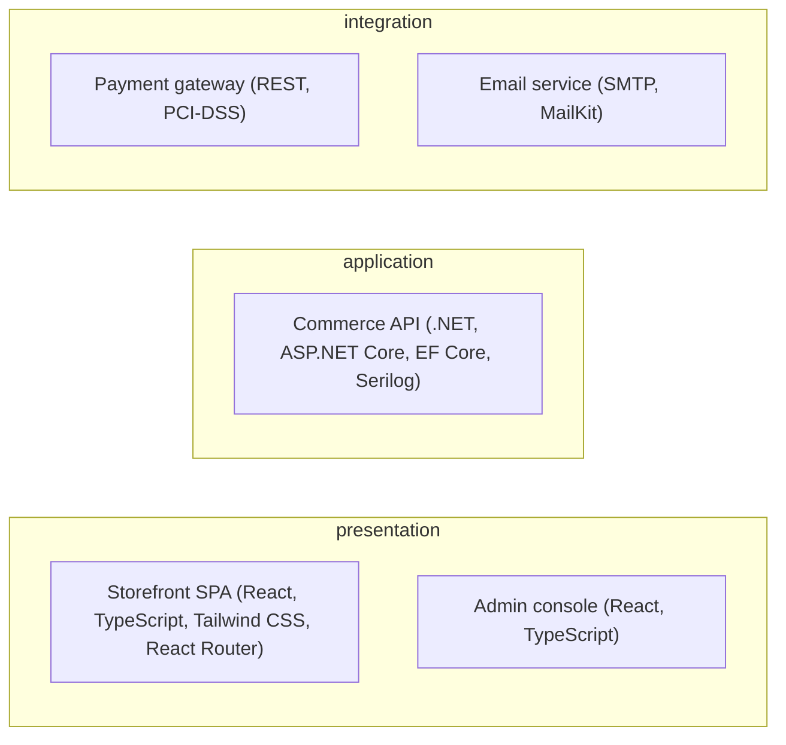

# High-Level Design (HLD)

## Architecture Overview

## Components

| ID | Component | Layer | Responsibility | Status |
| --- | --- | --- | --- | --- |
| CMP-0101 | Storefront SPA | presentation | React storefront: catalog, cart, checkout, account. | `approved` |
| CMP-0102 | Commerce API | application | ASP.NET Core REST API with EF Core and Serilog. | `approved` |
| CMP-0103 | Admin console | presentation | React admin UI for catalog, inventory, and analytics. | `approved` |
| CMP-0104 | Commerce database | infrastructure | Relational store for customers, orders, and inventory. | `approved` |
| CMP-0105 | Payment gateway | integration | Tokenized card processing and refunds. | `approved` |
| CMP-0106 | Email service | integration | Order confirmation and restock notifications. | `approved` |
| CMP-0107 | Cache | infrastructure | Read-path caching for catalog and product detail. | `approved` |
## Design Principles

- Database is the source of truth.
- Generated output is always English Markdown.
- Traceability and stable IDs everywhere.
