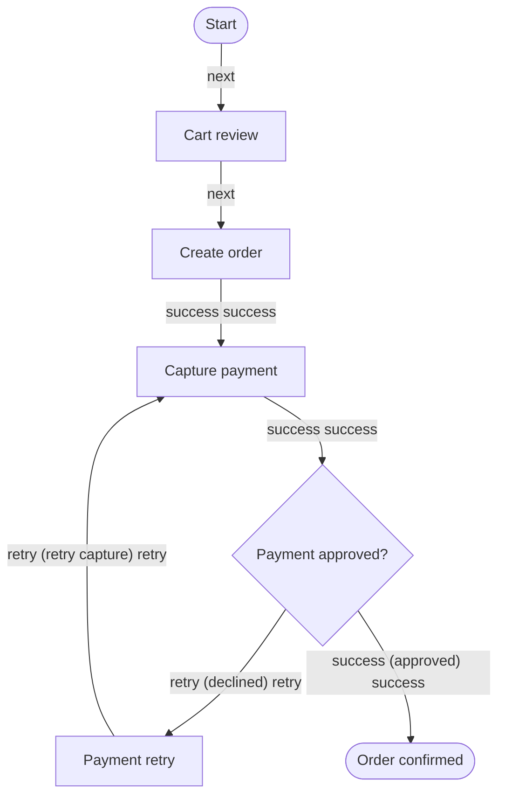
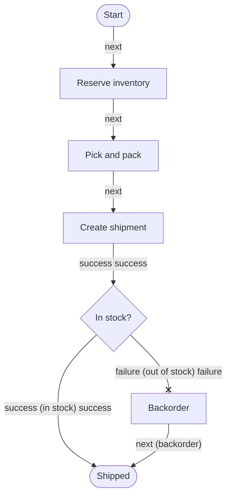
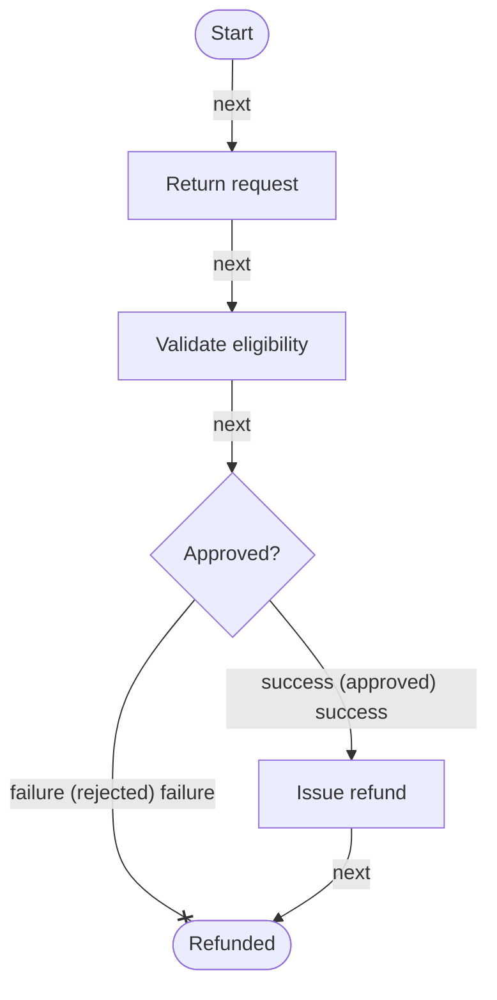
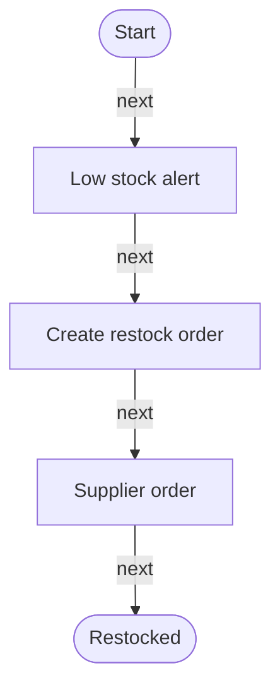

# Workflows

## Workflow Models

### GRPH-0004 — Checkout flow

Status: `reviewed` · Order placement from cart review to payment capture and confirmation.

### GRPH-0005 — Order fulfillment

Status: `reviewed` · Reserve inventory, pick and pack, ship, and track delivery.

### GRPH-0006 — Refund & returns

Status: `reviewed` · Validate a return request and issue a refund through the gateway.

### GRPH-0007 — Inventory restock

Status: `reviewed` · Detect low stock, create a restock order, and update on receipt.

## Rules

- Every workflow has a start and an end.
- Decision nodes require conditions on outgoing edges (TR-04).
- Cross-project workflow calls point at a workflow-kind graph of another project (TR-21).
- Diagrams are generated from structured data — never hand-written Mermaid.
