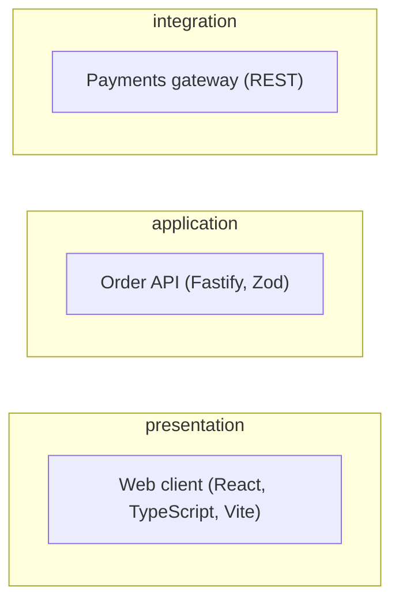

# High-Level Design (HLD)

## Architecture Overview

## Components

| ID | Component | Layer | Responsibility | Status |
| --- | --- | --- | --- | --- |
| CMP-0001 | Web client | presentation | React storefront and admin UI. | `approved` |
| CMP-0002 | Order API | application | Checkout, order, and payment orchestration. | `approved` |
| CMP-0003 | Orders DB | infrastructure | Orders and customer accounts. | `approved` |
| CMP-0004 | Payments gateway | integration | Card processing provider integration. | `approved` |
## Design Principles

- Database is the source of truth.
- Generated output is always English Markdown.
- Traceability and stable IDs everywhere.
