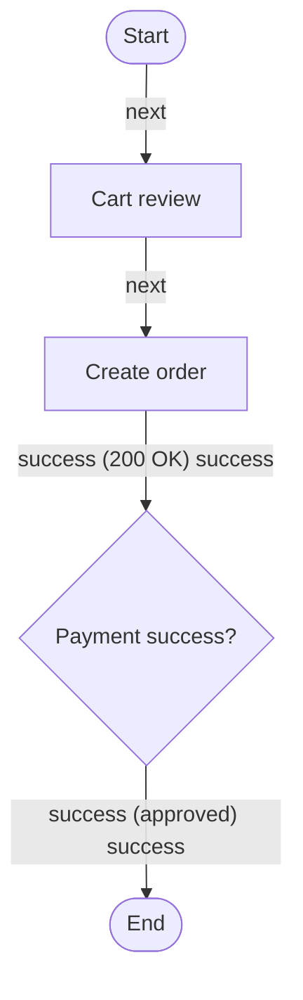

# Workflows

## Workflow Models

### GRPH-0001 — Checkout flow

Status: `reviewed` · Order placement from cart review to confirmation.

## Rules

- Every workflow has a start and an end.
- Decision nodes require conditions on outgoing edges (TR-04).
- Diagrams are generated from structured data — never hand-written Mermaid.
